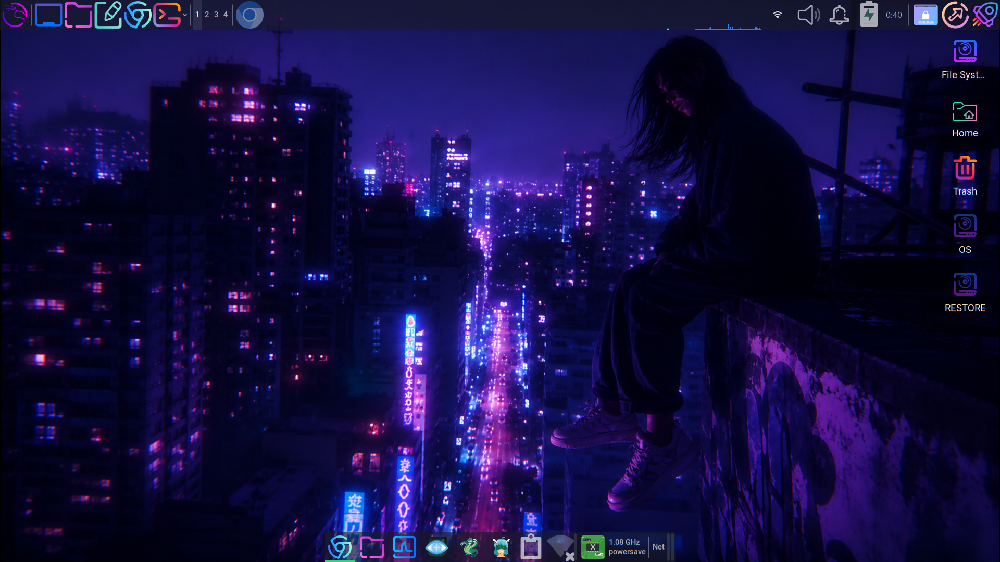
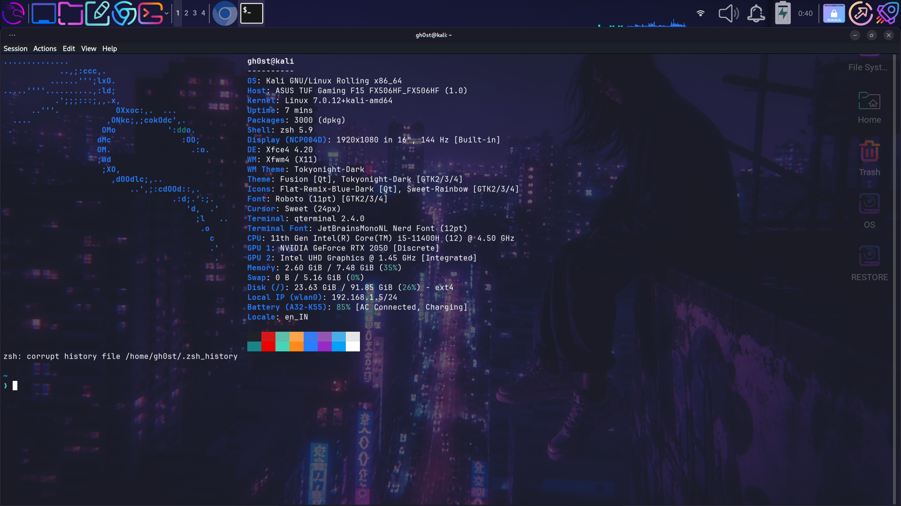
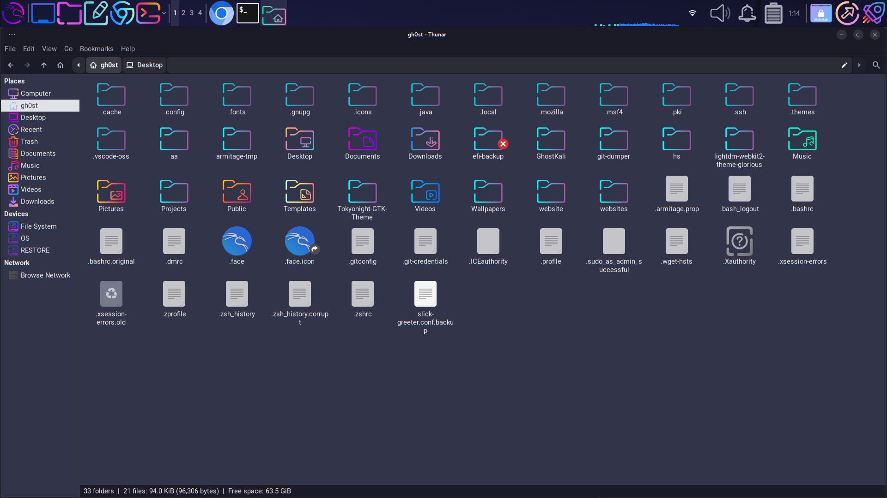
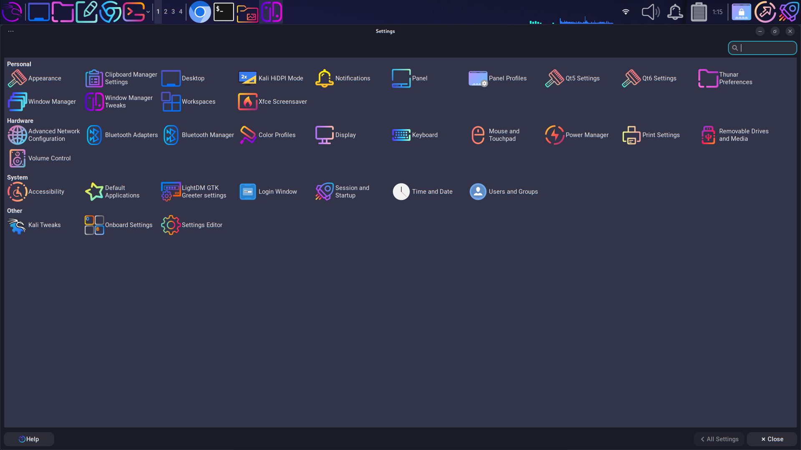

# 👻 GhostKali

### Personal Kali Linux Backup & Restore Toolkit

<p align="center">
  <strong>Configure once. Restore anywhere.</strong>
</p>

<p align="center">
  A personal backup, restoration, and customization toolkit for Kali Linux XFCE.
</p>

---

## 🖥️ Showcase

<p align="center">
  
</p>

<p align="center">
  <em>GhostKali customized desktop environment</em>
</p>

<br>

<p align="center">
  
  
</p>

<p align="center">
  <em>Customized terminal and file manager environment</em>
</p>

<br>

<p align="center">
  
</p>

<p align="center">
  <em>GhostKali desktop configuration and visual customization</em>
</p>

---

## 🧩 What is GhostKali?

GhostKali is a personal configuration and restoration toolkit created to preserve a customized Kali Linux XFCE environment.

Instead of manually rebuilding a customized system after a reinstall or migration, GhostKali keeps important configuration, themes, icons, cursors, wallpapers, package lists, shell configuration, and other user-level customizations organized inside a single repository.

The project provides scripts for installing, backing up, restoring, and updating the environment.

> **The goal:** make rebuilding a familiar Kali Linux workspace faster, more consistent, and repeatable.

---

## ✨ Highlights

- 🖥️ Customized XFCE desktop environment
- 🐚 ZSH + Powerlevel10k configuration
- 🎨 GTK themes and visual customization
- 🎯 Multiple icon themes
- 🖱️ Custom cursor themes
- 🖼️ Wallpaper collection
- 📦 Package manifests
- 🔤 Automatic font installation
- 💾 Backup and restore scripts
- 🔄 Update workflow
- 🧰 Organized configuration repository
## 🧩 What's Included?

GhostKali preserves the important parts of a customized Kali Linux XFCE environment so the system can be rebuilt without manually configuring everything again.

### 🖥️ Desktop Environment

GhostKali preserves a customized Kali Linux XFCE desktop environment, including:

- XFCE panel configuration
- Desktop settings
- Window manager settings
- Keyboard shortcuts
- Autostart entries
- Desktop appearance preferences
- User-level XFCE configuration

The goal is to reproduce the same desktop workflow after reinstalling or migrating to another Kali Linux installation.

### 🐚 Shell Environment

The repository preserves shell customization through:

- ZSH configuration
- Powerlevel10k configuration
- Git configuration
- Custom shell aliases and environment settings

The primary shell configuration is maintained inside:

```text
dotfiles/.zshrc
```

### 🎨 Themes

GhostKali includes customized GTK and desktop themes, including TokyoNight-based variants.

Available themes include:

```text
themes/
├── Tokyonight-Dark/
├── Tokyonight-Dark-hdpi/
├── Tokyonight-Dark-xhdpi/
├── Tokyonight-Light/
├── Tokyonight-Light-hdpi/
└── Tokyonight-Light-xhdpi/
```

These themes are stored inside the repository so they can be restored along with the rest of the desktop environment.

### 🎯 Icons

GhostKali maintains custom icon themes used by the desktop environment.

Icon configurations are preserved separately so that the visual appearance of applications, folders, system elements, and desktop components can be restored consistently.

### 🖱️ Cursors

Custom cursor themes are included as part of the visual customization.

This allows the cursor appearance to be restored together with the GTK themes and icon configuration.

### 🖼️ Wallpapers

GhostKali maintains a collection of wallpapers used by the customized desktop environment.

Wallpapers are stored inside the repository and can be restored without manually searching for or downloading them again.

### 🔤 Fonts

The repository includes an automatic font installation workflow.

Font installation is handled through:

```text
scripts/install_fonts.sh
```

This allows required fonts to be installed automatically instead of configuring them manually after every system installation.

### 📦 Package Lists

GhostKali maintains package manifests containing the software packages required by the environment.

Package lists allow a fresh Kali Linux installation to recreate the required software environment more easily.

Example package manifests include:

```text
packages/
├── apt-packages.txt
├── pip-packages.txt
└── vscode-extensions.txt
```

The package lists are intended to make system reconstruction more consistent and repeatable.

### 💾 Backup and Restore

GhostKali provides scripts for managing the configuration lifecycle.

The main scripts are:

```text
backup.sh
restore.sh
install.sh
update.sh
```

Their roles are:

- `install.sh` — Install the GhostKali environment
- `backup.sh` — Create a backup of the current configuration
- `restore.sh` — Restore saved configuration
- `update.sh` — Update backup data from the current environment

### 🔄 Update Workflow

The update workflow allows the repository to be refreshed when the local Kali environment changes.

After modifying the desktop, shell, themes, packages, or other supported configuration:

```bash
./update.sh
```

can be used to update the stored backup data.

This keeps the repository synchronized with the current customized environment.

### 📁 Repository Structure

The project is organized into dedicated directories for configuration, themes, packages, scripts, screenshots, and documentation.

```text
GhostKali/
├── backup.sh
├── restore.sh
├── install.sh
├── update.sh
│
├── dotfiles/
│   └── .zshrc
│
├── themes/
│   ├── Tokyonight-Dark/
│   ├── Tokyonight-Dark-hdpi/
│   ├── Tokyonight-Dark-xhdpi/
│   ├── Tokyonight-Light/
│   ├── Tokyonight-Light-hdpi/
│   └── Tokyonight-Light-xhdpi/
│
├── icons/
│
├── cursors/
│
├── wallpapers/
│
├── packages/
│   ├── apt-packages.txt
│   ├── pip-packages.txt
│   └── vscode-extensions.txt
│
├── scripts/
│   └── install_fonts.sh
│
├── screenshots/
│
├── docs/
│
├── CHANGELOG.md
├── CONTRIBUTING.md
├── SECURITY.md
├── TODO.md
├── VERSION
├── LICENSE
└── README.md
```

### 🖼️ Screenshots

The repository includes screenshots demonstrating the customized GhostKali environment.

<p align="center">
  
</p>

<p align="center">
  
  
</p>

<p align="center">
  <em>GhostKali customized terminal and file manager environment.</em>
</p>

<p align="center">
  
</p>

<p align="center">
  <em>GhostKali desktop configuration and visual customization.</em>
</p>

---

## ⚙️ How GhostKali Works

GhostKali follows a simple configuration lifecycle:

```text
Current Kali Linux Environment
            │
            ▼
       ./backup.sh
            │
            ▼
    Repository Backup Data
            │
            ▼
       Git Repository
            │
            ▼
   Fresh Kali Installation
            │
            ▼
       ./install.sh
            │
            ▼
    Restored GhostKali
```

The repository separates configuration data from the scripts responsible for installing, backing up, restoring, and updating that data.

This makes the project easier to maintain and reduces the amount of manual configuration required when rebuilding the system.

---

## 🚀 Installation

Clone the repository:

```bash
git clone https://github.com/COLD7NAAVI/Gh0stKali.git
cd Gh0stKali
```

Make the scripts executable:

```bash
chmod +x *.sh
```

Run the installer:

```bash
./install.sh
```

The installation process restores the supported GhostKali configuration and customization from the repository.

---

## 💾 Creating a Backup

To create a backup of the current environment:

```bash
./backup.sh
```

The backup process collects the supported configuration and stores it in the appropriate repository directories.

After making changes to the environment, the backup can be updated again to keep the repository current.

---

## 🔄 Updating Backup Data

To update the stored configuration:

```bash
./update.sh
```

This is useful after changing:

- XFCE settings
- Shell configuration
- Themes
- Icons
- Cursors
- Wallpapers
- Package selections
- Other supported customization

---

## ♻️ Restoring the Environment

To restore the saved GhostKali configuration:

```bash
./restore.sh
```

The restore script applies the stored configuration back to the user's environment.

This is particularly useful after:

- Reinstalling Kali Linux
- Migrating to another machine
- Rebuilding a development environment
- Recovering from a system reset
- Recreating the same desktop setup

---

## 🎯 Project Goal

GhostKali is designed around one simple idea:

> **Your customized Linux environment should be reproducible.**

Instead of spending hours rebuilding the same desktop, shell, themes, fonts, packages, and visual configuration after a fresh installation, GhostKali keeps the important pieces organized inside a version-controlled repository.

The project is intended to make rebuilding a familiar Kali Linux environment:

**faster • more consistent • repeatable • maintainable**

---

## 🛠️ Intended Environment

GhostKali is primarily designed around:

- Kali Linux
- XFCE
- ZSH
- Powerlevel10k
- Git

Some configuration components may depend on the software and packages available on the target system.

For best results, use GhostKali on a Kali Linux installation with the required desktop environment and dependencies available.

---

## 📌 Important Notes

GhostKali is a **personal configuration and restoration toolkit** rather than a complete operating-system image.

It does not replace a full system backup.

The repository focuses on preserving user-level configuration, customization, package information, and restoration scripts.

Always maintain separate backups of important personal files and data.

---
## 🧩 Project Structure

The repository is organized so that configuration files, visual assets, package information, documentation, and automation scripts remain separated and easy to maintain.

```text
GhostKali/
├── configs/                  # XFCE and application configuration
│
├── dotfiles/                 # Shell and user configuration
│   └── .zshrc                # ZSH configuration
│
├── fonts/                    # Custom fonts
│
├── icons/                    # Icon themes
│
├── cursors/                  # Cursor themes
│
├── themes/                   # GTK and desktop themes
│   ├── Tokyonight-Dark/
│   ├── Tokyonight-Dark-hdpi/
│   ├── Tokyonight-Dark-xhdpi/
│   ├── Tokyonight-Light/
│   ├── Tokyonight-Light-hdpi/
│   └── Tokyonight-Light-xhdpi/
│
├── wallpapers/               # Desktop wallpapers
│
├── packages/                 # Package manifests
│   ├── apt-packages.txt
│   ├── pip-packages.txt
│   ├── npm-packages.txt
│   └── vscode-extensions.txt
│
├── scripts/                  # Supporting scripts
│   └── install_fonts.sh
│
├── screenshots/              # Project screenshots
│   ├── desktop.png
│   ├── file-manager.png
│   ├── settings.png
│   └── terminal.png
│
├── docs/                     # Additional documentation
│
├── backup.sh                 # Create a configuration backup
├── restore.sh                # Restore the saved configuration
├── install.sh                # Install GhostKali
├── update.sh                 # Update backup data
│
├── CHANGELOG.md              # Project changelog
├── CONTRIBUTING.md           # Contribution guidelines
├── SECURITY.md               # Security information
├── TODO.md                   # Planned improvements
├── VERSION                   # Current project version
├── LICENSE                   # MIT License
└── README.md                 # Project documentation
```

---

## ⚙️ How GhostKali Works

GhostKali follows a simple configuration-management workflow.

```text
             ┌─────────────────────┐
             │   Kali Linux Host   │
             └──────────┬──────────┘
                        │
                        ▼
             ┌─────────────────────┐
             │      backup.sh      │
             │ Capture configuration│
             └──────────┬──────────┘
                        │
                        ▼
             ┌─────────────────────┐
             │     GhostKali       │
             │     Repository      │
             └──────────┬──────────┘
                        │
             ┌──────────┴──────────┐
             │                     │
             ▼                     ▼
       ┌─────────────┐       ┌─────────────┐
       │  update.sh  │       │ Git / GitHub │
       └─────────────┘       └─────────────┘
             │                     │
             └──────────┬──────────┘
                        ▼
             ┌─────────────────────┐
             │     restore.sh      │
             │ Rebuild environment │
             └──────────┬──────────┘
                        │
                        ▼
             ┌─────────────────────┐
             │  Restored Workspace │
             └─────────────────────┘
```

The repository acts as the source of truth for the configuration that GhostKali is intended to preserve.

---

## 💾 Backup Workflow

The backup workflow captures important user-level configuration and package information and stores it inside the repository.

Run:

```bash
./backup.sh
```

The backup process is intended to preserve configuration such as:

- XFCE desktop settings
- Panel configuration
- ZSH configuration
- Powerlevel10k configuration
- Git configuration
- Themes
- Icons
- Cursors
- Wallpapers
- Installed package information
- Font information
- Other supported user-level configuration

After creating or updating a backup, the resulting changes can be reviewed with Git:

```bash
git status
```

Then commit the changes when appropriate:

```bash
git add .
git commit -m "Update GhostKali backup"
```

---

## 🔄 Restore Workflow

The restore workflow is intended to rebuild the GhostKali environment from the repository.

Run:

```bash
./restore.sh
```

The restoration process uses the configuration and resources stored inside the repository to recreate the supported environment.

This is particularly useful after:

- Reinstalling Kali Linux
- Migrating to another machine
- Rebuilding a development environment
- Recovering from a system reset
- Recreating the same customized desktop setup

The exact result of a restoration depends on the target system, installed dependencies, desktop environment, and packages available on that system.

---

## 🚀 Installation

Clone the repository:

```bash
git clone https://github.com/COLD7NAAVI/Gh0stKali.git
cd Gh0stKali
```

Make the scripts executable:

```bash
chmod +x *.sh
```

Run the installer:

```bash
./install.sh
```

After installation, review the restored configuration and restart applications or log out and back in when required for desktop or shell changes to take effect.

---

## 🔁 Updating GhostKali

When the current Kali environment has changed and those changes should be preserved in the repository, run:

```bash
./update.sh
```

Review the resulting Git changes:

```bash
git status
git diff
```

If everything looks correct, commit the update:

```bash
git add .
git commit -m "Update GhostKali configuration"
git push
```

This keeps the repository synchronized with the current workstation configuration.

---
## 💾 Backup Workflow

GhostKali can capture the current user-level configuration of the Kali Linux environment and store the relevant data inside the repository.

This is useful when the workstation has been customized further and those changes need to be preserved.

Run:

```bash
./backup.sh
```

The backup process is intended to preserve configuration such as:

- XFCE desktop configuration
- GTK configuration
- Terminal configuration
- Zsh configuration
- Powerlevel10k configuration
- Git configuration
- Themes and icons
- Cursor configuration
- Wallpapers
- Autostart entries
- Package information
- Other supported user-level configuration

After running the backup, review the changes before committing them.

```bash
git status
git diff
```

If the changes are correct:

```bash
git add .
git commit -m "Update GhostKali backup"
git push
```

This keeps the repository synchronized with the latest known workstation configuration.

---

## 🔄 Restore Workflow

The restore workflow is intended to rebuild the GhostKali environment from the configuration stored in the repository.

Run:

```bash
./restore.sh
```

The restoration process may restore supported configuration for:

- XFCE
- GTK
- Zsh
- Powerlevel10k
- Git
- Themes
- Icons
- Cursors
- Wallpapers
- Terminal configuration
- Other supported user-level settings

After restoration, some changes may require:

- Logging out and back in
- Restarting the affected application
- Restarting the shell
- Restarting the desktop session

For example, Zsh configuration can be reloaded with:

```bash
source ~/.zshrc
```

The restore script should be used carefully and reviewed before applying it to an existing environment.

---

## 🛠️ Configuration Philosophy

GhostKali is designed around **configuration preservation rather than full-system cloning**.

The repository does not attempt to reproduce every file on the operating system.

Instead, it focuses on the parts of the environment that are most important for recreating the customized workspace.

The general model is:

```text
Kali Linux
    │
    ├── Desktop configuration
    ├── Shell configuration
    ├── Themes
    ├── Icons
    ├── Cursors
    ├── Wallpapers
    ├── Fonts
    ├── Package manifests
    └── User-level configuration
             │
             ▼
        GhostKali Repository
             │
             ├── Backup
             ├── Version control
             ├── Restore
             └── Rebuild
```

This approach keeps the repository focused, portable, and easier to maintain.

---

## 📦 Package Management

GhostKali maintains package information separately from the configuration files.

This makes it possible to recreate the software environment without storing the installed packages themselves inside the repository.

Package manifests may include:

```text
packages/
├── apt-packages.txt
├── pip-packages.txt
├── npm-packages.txt
└── vscode-extensions.txt
```

These files provide a reference for rebuilding the development and customization environment.

### APT Packages

The APT package manifest records packages installed through the Debian/Kali package manager.

Example:

```bash
sudo apt install <package-name>
```

### Python Packages

Python dependencies can be tracked separately through the PIP package manifest.

Example:

```bash
pip install <package-name>
```

### NPM Packages

Node.js related packages can be documented through the NPM package manifest.

Example:

```bash
npm install <package-name>
```

### VS Code Extensions

Development-related VS Code extensions are maintained separately so that the development environment can also be recreated.

---

## 🔤 Font Management

GhostKali includes a dedicated font installation script.

The supporting script is located at:

```text
scripts/install_fonts.sh
```

Run it with:

```bash
./scripts/install_fonts.sh
```

The purpose of this script is to make font installation repeatable instead of requiring each font to be installed manually.

Fonts are treated as part of the visual and development environment because terminal readability, editor appearance, and prompt rendering depend heavily on the selected font configuration.

---

## 🖥️ Desktop Configuration

GhostKali preserves important XFCE configuration so that the desktop environment can be restored without manually rebuilding every setting.

This includes configuration related to:

- XFCE panels
- Panel plugins
- Desktop appearance
- Window manager settings
- Keyboard shortcuts
- Application preferences
- Autostart entries
- File manager preferences
- Desktop behavior

The goal is not to create a completely new desktop environment.

The goal is to preserve the customized environment already established on the workstation.

---

## 🐚 Shell Configuration

The shell environment is an important part of GhostKali.

The repository preserves configuration related to:

- Zsh
- Oh My Zsh
- Powerlevel10k
- Git
- Aliases
- Environment variables
- Shell customization

The primary Zsh configuration is maintained inside:

```text
dotfiles/.zshrc
```

This allows the shell environment to be restored consistently across supported installations.

---

## 🧹 What GhostKali Does Not Store

GhostKali intentionally does not attempt to store everything from the operating system.

The repository should not be treated as a complete disk image or full system backup.

It is primarily intended to preserve:

- Configuration
- Customization
- Package information
- Themes
- User-level environment settings
- Restoration scripts

Personal files, private credentials, browser profiles, SSH private keys, tokens, and other sensitive information should not be committed to the repository.

Always review repository changes before pushing them to a remote Git repository.

---

## 🔐 Security Considerations

GhostKali is designed for a security-focused Kali Linux workstation, but the repository itself should still follow normal security practices.

Do not commit:

```text
Passwords
API keys
Authentication tokens
Private SSH keys
Private certificates
Browser session data
Personal documents
Other sensitive credentials
```

Before committing changes, review:

```bash
git status
git diff
```

If sensitive information is accidentally added, remove it from the repository and rotate the exposed credential where appropriate.

For additional security information, see:

```text
SECURITY.md
```

---

## 📝 Documentation

GhostKali keeps project documentation separate from the actual configuration files.

Important documentation files include:

```text
README.md
CHANGELOG.md
CONTRIBUTING.md
SECURITY.md
TODO.md
VERSION
LICENSE
```

Each file has a specific purpose:

- `README.md` — Main project documentation
- `CHANGELOG.md` — Project changes and release history
- `CONTRIBUTING.md` — Contribution guidelines
- `SECURITY.md` — Security information and reporting
- `TODO.md` — Planned improvements
- `VERSION` — Current project version
- `LICENSE` — Project license

---

## 🚧 Project Status

GhostKali is an evolving personal configuration and restoration project.

The repository may continue to grow as new customizations, packages, themes, scripts, and restoration capabilities are added.

The project prioritizes:

**Reproducibility → Consistency → Maintainability → Simplicity**

Future improvements may include better automation, additional configuration coverage, improved restoration handling, and more structured environment validation.

---
